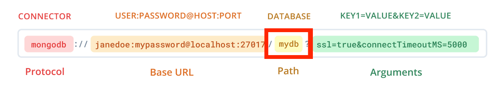
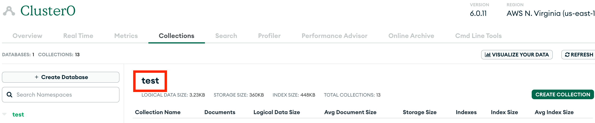

# Web Programming HW4

## 執行

### 1. 安裝套件

```shell
npm i
```

### 2. 設定環境變數

```shell
cp .env.example .env
```

.env應包含以下內容，自行建立.env檔時需注意是否都有輸入
（各參數取得方式與注意事項請參見下方的[設定](#設定)部分）

```js
DATABASE_URL = NEXTAUTH_SECRET = "RANDOM_STRING";

PUSHER_APP_ID =
  NEXT_PUBLIC_PUSHER_APP_KEY =
  PUSHER_SECRET =
  NEXT_PUBLIC_PUSHER_CLUSTER =
  NEXT_PUBLIC_CLOUDINARY_CLOUD_NAME =
    dxzs106qt;
```

### 3. 設定Prisma

Prisma跟drizzle一樣都是用在Node.js上的ORM（Object Relational Mapper）

```shell
npx prisma db push
```

### 4. 執行程式

執行前請確定Port 3000可供使用

```shell
npm run dev
```

程式執行於 [http://localhost:3000](http://localhost:3000)

## 設定

### 1. Database url

請使用**MongoDB**的connection url


**請注意在connection url中`.mongodb.net`與`?`之間（上圖紅框處）加上`/<database名稱>`**

database名稱在mongoDB網站中下圖紅框處的位置可以找到


### 2. NextAuth

請參考[112-1-unit2-notion-clone的README.md的NextAuth Setup部分](https://github.com/ntuee-web-programming/112-1-unit2-notion-clone/blob/main/README.md#nextauth-setup)

### 3. Pusher

請參考[112-1-unit2-notion-clone的README.md的Pusher Setup部分](https://github.com/ntuee-web-programming/112-1-unit2-notion-clone/blob/main/README.md#pusher-setup)
